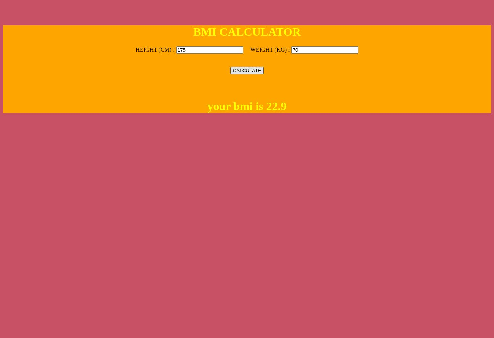
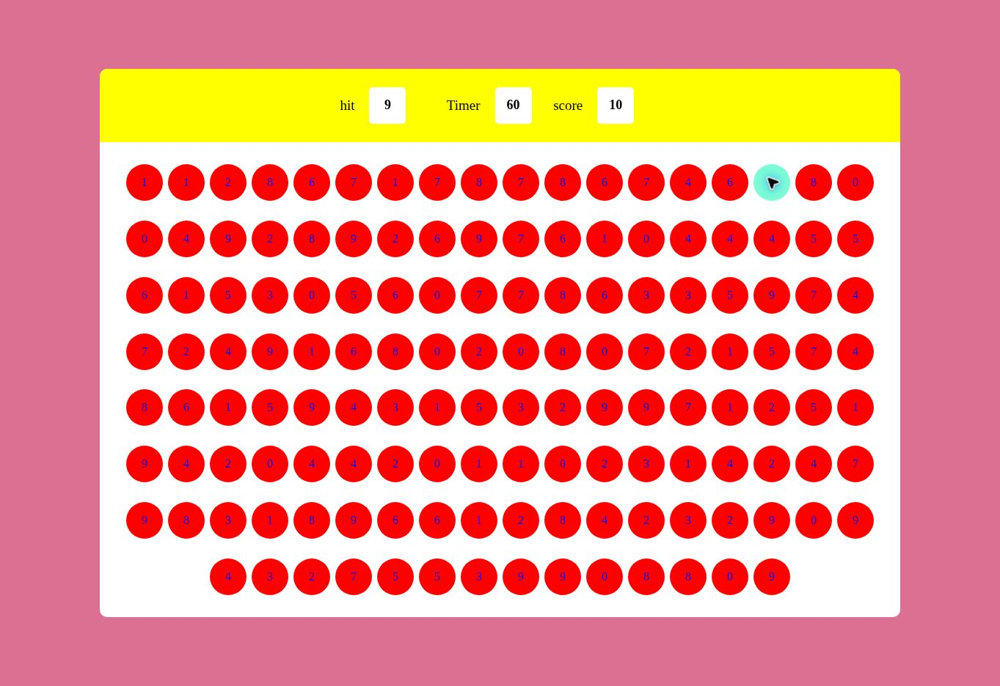
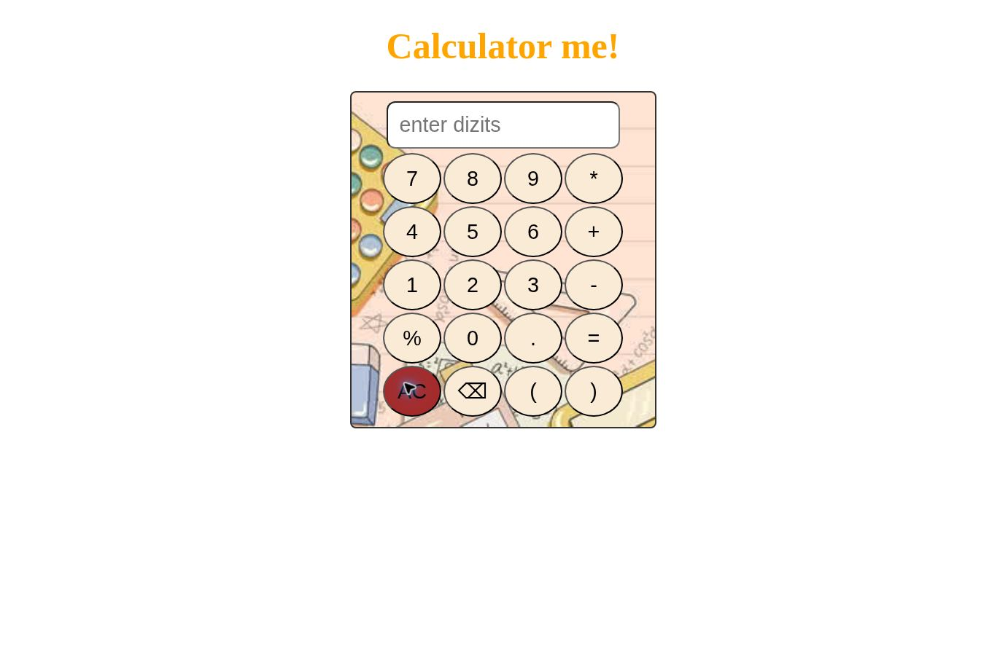
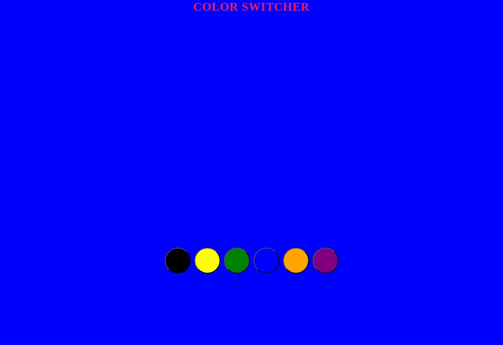
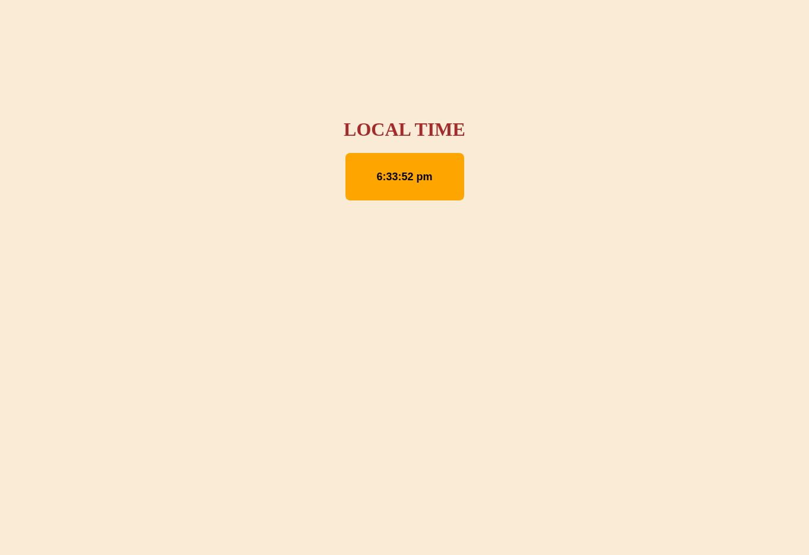
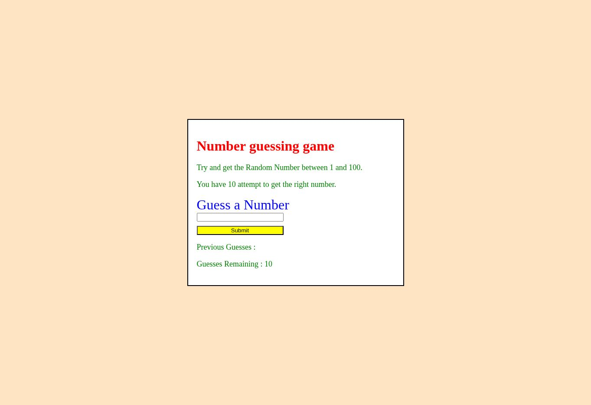
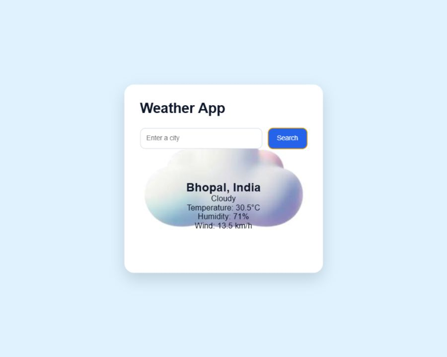

# JavaScript Practice Projects

A collection of small, beginner-friendly web projects created to strengthen my understanding of **JavaScript, DOM manipulation, event handling, functions, timers, validation, and API integration**.

This repository documents my hands-on learning journey. Each project is kept in its own folder and focuses on a different JavaScript concept.

[](https://developer.mozilla.org/en-US/docs/Web/JavaScript)
[](https://developer.mozilla.org/en-US/docs/Web/HTML)
[](https://developer.mozilla.org/en-US/docs/Web/CSS)

## Projects

| # | Project | Description | Key concepts | Status |
|---|---------|-------------|--------------|--------|
| 1 | [BMI Calculator](https://github.com/RahulShukla3300/Learn-JavaScript-Practice-Project/tree/main/BMI%20CALCULATOR) · [Live Demo](https://rahulshukla3300.github.io/Learn-JavaScript-Practice-Project/BMI%20CALCULATOR/) | Calculates BMI using height and weight and displays the relevant weight category. | Input validation, calculations, conditionals | Completed |
| 2 | [Bubble Game](https://github.com/RahulShukla3300/Learn-JavaScript-Practice-Project/tree/main/Bubble%20Game) · [Live Demo](https://rahulshukla3300.github.io/Learn-JavaScript-Practice-Project/Bubble%20Game/) | A 60-second number-matching game with randomly generated bubbles, a target number and score tracking. | DOM generation, events, timers, game logic | Completed |
| 3 | [Calculator](https://github.com/RahulShukla3300/Learn-JavaScript-Practice-Project/tree/main/CALCULATOR%20JS%2CCSS%2CHTML) · [Live Demo](https://rahulshukla3300.github.io/Learn-JavaScript-Practice-Project/CALCULATOR%20JS%2CCSS%2CHTML/) | Performs basic calculations and includes clear, backspace and error-handling functionality. | Event handling, string operations, error handling | Completed |
| 4 | [Color Switcher](https://github.com/RahulShukla3300/Learn-JavaScript-Practice-Project/tree/main/Color%20Switcher) · [Live Demo](https://rahulshukla3300.github.io/Learn-JavaScript-Practice-Project/Color%20Switcher/) | Changes the page background when a user selects one of the available colours. | DOM selection, click events, style manipulation | Completed |
| 5 | [Digital Clock](https://github.com/RahulShukla3300/Learn-JavaScript-Practice-Project/tree/main/DIG%20CLOCK) · [Live Demo](https://rahulshukla3300.github.io/Learn-JavaScript-Practice-Project/DIG%20CLOCK/) | Displays the current local time and refreshes it every second. | Date object, `setInterval`, DOM updates | Completed |
| 6 | [Guess the Number](https://github.com/RahulShukla3300/Learn-JavaScript-Practice-Project/tree/main/Guess%20The%20Num) · [Live Demo](https://rahulshukla3300.github.io/Learn-JavaScript-Practice-Project/Guess%20The%20Num/) | A number-guessing game from 1–100 with ten attempts, high/low hints and a restart option. | Random numbers, validation, arrays, game state | Completed |
| 7 | [Random Password Generator](https://github.com/RahulShukla3300/Learn-JavaScript-Practice-Project/tree/main/Random%20Password%20Generator) · [Live Demo](https://rahulshukla3300.github.io/Learn-JavaScript-Practice-Project/Random%20Password%20Generator/Index.html) | Generates an eight-character random password and automatically clears it after five seconds. | Randomisation, loops, strings, `setTimeout` | Completed |
| 8 | [To-Do List](https://github.com/RahulShukla3300/Learn-JavaScript-Practice-Project/tree/main/To-Do%20List) | A task-management project for practising dynamic list operations. | Forms, DOM manipulation, events | In progress |
| 9 | [Weather App](https://github.com/RahulShukla3300/Learn-JavaScript-Practice-Project/tree/main/Wheather%20API%20fetch) · [Live Demo](https://rahulshukla3300.github.io/Learn-JavaScript-Practice-Project/Wheather%20API%20fetch/) | Version 1 of a city-based weather app that fetches and displays weather details from an external API. | User input, validation, Fetch API, API integration | Completed v1 |

## Featured Live Demos

### BMI Calculator

[](https://rahulshukla3300.github.io/Learn-JavaScript-Practice-Project/BMI%20CALCULATOR/)

**Features:** Height and weight inputs, BMI calculation, validation and a clear numerical result.

[View Live Demo](https://rahulshukla3300.github.io/Learn-JavaScript-Practice-Project/BMI%20CALCULATOR/) · [View Source](https://github.com/RahulShukla3300/Learn-JavaScript-Practice-Project/tree/main/BMI%20CALCULATOR)

### Bubble Game

[](https://rahulshukla3300.github.io/Learn-JavaScript-Practice-Project/Bubble%20Game/)

**Features:** Random bubbles, target-number matching, a 60-second timer and score tracking.

[View Live Demo](https://rahulshukla3300.github.io/Learn-JavaScript-Practice-Project/Bubble%20Game/) · [View Source](https://github.com/RahulShukla3300/Learn-JavaScript-Practice-Project/tree/main/Bubble%20Game)

### Calculator

[](https://rahulshukla3300.github.io/Learn-JavaScript-Practice-Project/CALCULATOR%20JS%2CCSS%2CHTML/)

**Features:** Basic arithmetic operations, clear button, backspace support and calculation error handling.

**Responsive design:** Flexible container and controls adapt to desktop and mobile screen widths.

[View Live Demo](https://rahulshukla3300.github.io/Learn-JavaScript-Practice-Project/CALCULATOR%20JS%2CCSS%2CHTML/) · [View Source](https://github.com/RahulShukla3300/Learn-JavaScript-Practice-Project/tree/main/CALCULATOR%20JS%2CCSS%2CHTML)

### Color Switcher

[](https://rahulshukla3300.github.io/Learn-JavaScript-Practice-Project/Color%20Switcher/)

**Features:** Six colour choices, click-based interaction and instant background updates.

[View Live Demo](https://rahulshukla3300.github.io/Learn-JavaScript-Practice-Project/Color%20Switcher/) · [View Source](https://github.com/RahulShukla3300/Learn-JavaScript-Practice-Project/tree/main/Color%20Switcher)

### Digital Clock

[](https://rahulshukla3300.github.io/Learn-JavaScript-Practice-Project/DIG%20CLOCK/)

**Features:** Current local time, automatic one-second updates and a simple focused display.

[View Live Demo](https://rahulshukla3300.github.io/Learn-JavaScript-Practice-Project/DIG%20CLOCK/) · [View Source](https://github.com/RahulShukla3300/Learn-JavaScript-Practice-Project/tree/main/DIG%20CLOCK)

### Guess the Number

[](https://rahulshukla3300.github.io/Learn-JavaScript-Practice-Project/Guess%20The%20Num/)

**Features:** Random number generation, ten attempts, high/low hints, previous guesses and restart functionality.

**Responsive design:** Responsive wrapper, input and button adapt to screens below 600px.

[View Live Demo](https://rahulshukla3300.github.io/Learn-JavaScript-Practice-Project/Guess%20The%20Num/) · [View Source](https://github.com/RahulShukla3300/Learn-JavaScript-Practice-Project/tree/main/Guess%20The%20Num)

### Random Password Generator

[](https://rahulshukla3300.github.io/Learn-JavaScript-Practice-Project/Random%20Password%20Generator/Index.html)

**Features:** One-click generation, an eight-character random password and automatic clearing after five seconds.

[View Live Demo](https://rahulshukla3300.github.io/Learn-JavaScript-Practice-Project/Random%20Password%20Generator/Index.html) · [View Source](https://github.com/RahulShukla3300/Learn-JavaScript-Practice-Project/tree/main/Random%20Password%20Generator)

### Weather App

[](https://rahulshukla3300.github.io/Learn-JavaScript-Practice-Project/Wheather%20API%20fetch/)

**Version 1 complete:** City search, input validation and weather API integration for displaying weather details.

[View Live Demo](https://rahulshukla3300.github.io/Learn-JavaScript-Practice-Project/Wheather%20API%20fetch/) · [View Source](https://github.com/RahulShukla3300/Learn-JavaScript-Practice-Project/tree/main/Wheather%20API%20fetch)

## Technologies Used

- HTML5
- CSS3
- JavaScript (ES6+)
- DOM API
- Browser Web APIs

## Running the Projects Locally

No package installation or build tool is required.

1. Clone the repository:

   ```bash
   git clone https://github.com/RahulShukla3300/Learn-JavaScript-Practice-Project.git
   ```

2. Open the repository folder:

   ```bash
   cd Learn-JavaScript-Practice-Project
   ```

3. Open any project folder and launch its `index.html` file in your browser.

For a better development experience, you can open the repository in VS Code and use the **Live Server** extension.

## Repository Structure

Each project is organised in a separate directory and generally contains:

```text
project-folder/
├── index.html
├── style.css
└── script.js
```

Some project filenames differ slightly; refer to the selected project folder for its exact structure.

## Learning Objectives

Through these projects, I am practising:

- Selecting and updating HTML elements with JavaScript
- Handling user interactions and browser events
- Validating form input
- Working with arrays, loops, functions and conditionals
- Managing timers with `setInterval` and `setTimeout`
- Generating random values and maintaining application state
- Integrating external APIs
- Organising small frontend projects clearly

## Planned Improvements

- Complete the To-Do List functionality
- Improve responsive behaviour across all projects
- Add screenshots and live demo links for the To-Do List
- Improve accessibility and keyboard support
- Refactor repeated logic and strengthen input validation

## Feedback and Contributions

Suggestions and constructive feedback are welcome. If you find an issue or have an improvement idea, feel free to open an issue or submit a pull request.

## Author

**Rahul Shukla**

- GitHub: [@RahulShukla3300](https://github.com/RahulShukla3300)
- LinkedIn: [rahul-shuklacse](https://www.linkedin.com/in/rahul-shuklacse)

If you find these practice projects useful, consider giving the repository a star.
